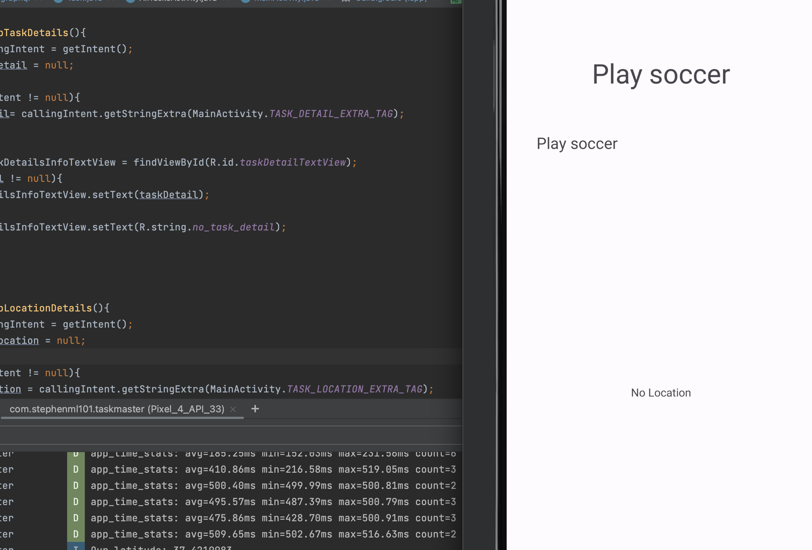

# taskmaster

## Lab 26 May 22, 2023

- Customized home page and all tasks page
- Created functionality to be able to navigate between the pages
- When the add task button is clicked, "Submitted" shows up
- See screenshots below:

## Lab 27 May 23, 2023

- Remade home page and replaced photo with 3 buttons
- Added settings page functionality and when a nickname is entered, it saves on the homepage as well.
- Hard coded 3 task buttons and when they are clicked, the title shows up on the task details page.
- Added a unit test
- Added APK in main
- See screenshots bellow
- Lab time to complete: 5 hours

### Settings Page

### New Home Page

### 3 Pages from buttons clicked on Home Page

## Lab 28 May 24, 2023

- Added functionality to scroll through tasks
- User can click on a task and the app will take them to the TaskDetailActivity page with the updated title
- APK updated
- Added enum class for the Task Model with new, assigned, in progress, and complete taskState (located under models)
- See main update to homepage with Recycler. I kept the original buttons in case I wanted to do something with them later.
- To do later: make margin between recycler buttons smaller and add more css.

### Updated Home Page w/ Recycler

### Large margin example

## Lab 29

- Added functionality so that the user can add a task, task description, and date

- When user clicks on the task on the recycler, the app takes them to the task detail page with the description

### Task with description

### New updated Recycler

### New Task Detail Page

## Lab 31 May 30, 2023

- Added all tests to project
  - ActivityDisplayTest
  - AllElementsDisplayedTest
  - UsernamHomepageTest

## Lab 32 May 31, 2023

- Refactored to add all data to DynamoDB
- All tasks show up
- Description also shows up when task is clicked
- Date was added to task as well

### Task with date showing

## Lab 33

- Completed Teams Class and populated task in database
- Still need to add to settings page

### Team View

### Database with ID

## Lab 34

- Added to Google Play Store. See screenshot below:

### Google Playstore Screenshot

## Lab 36 

- Cognito added with signup page 
- Signup verification page added
- Login page added
- Display username at home page
- Logout added

### Username

### Signup

### Verification email

### Verification Entered

### Login Page

### Homepage with name display

- TODO: Adjust height so all of name displays

## Lab 37

- Added photo functionality to Add Task Page. See screenshots below:

### New Add Task Page w/ photo icon in top right corner

### Android photo selection w/ photo

### S3 Storage w/ jpg name in bucket

### New photo on Add Task Page

Lab 39

- Location enabled
- Was able to get it to show up on LogCat but not the taskDetailPage

### Location Permission

### Logcat Location

### No Location displayed. Was able to get that to show.

## Lab 39 Update: Code fixed and location is showing on TaskDetailActivity

## Lab 41

- Added analytics for when the app is opened (see screenshot of AWS Pinpoint)

- Added speak button, no errors occur when button is pressed

- Translate text to spanish added to MainActivity for Second Predictions Integration

### AWS Pinpoint

### Speak Button

### Text Translate

## Lab 42

- All methods added for Interstitial Ad and Rewards Ad, as well as the Banner Ad

- There was an issue with Google AdMob. I could not update my information because the page would not load. I attached a screenshot.

- I believe that is why I have an error on my ap and it will not load. Please see the error below:

### Error

### AdMob issue

### Layout of what MainActivity should look like

